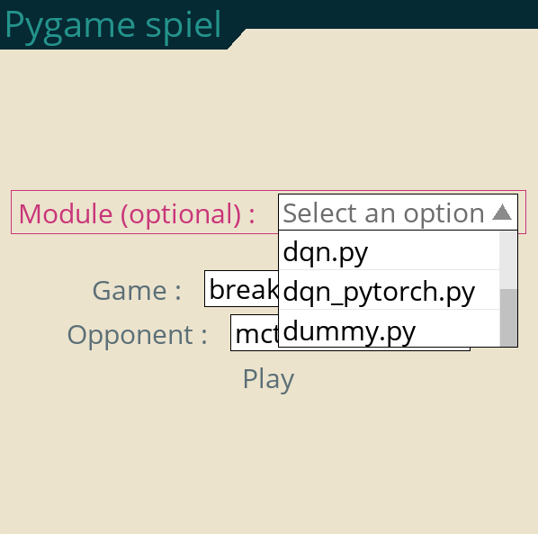
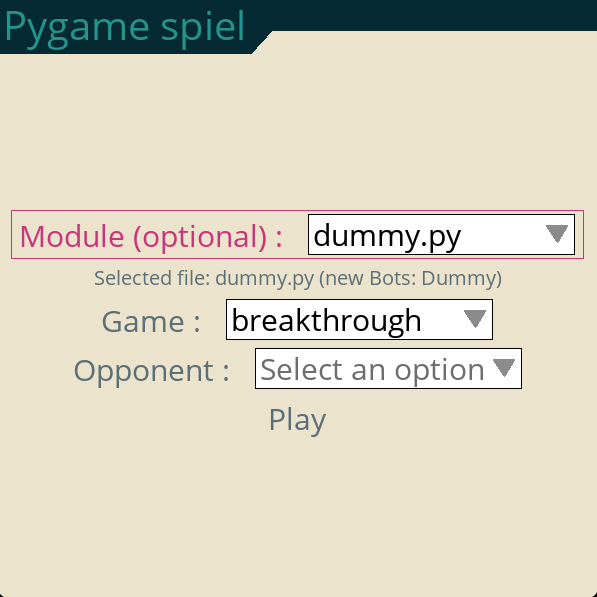
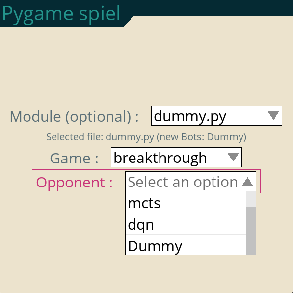

# Get started

## Play
If the user just wants to play with the available Bots and games, the procedure is simple. After launching PygameSpiel, the main menu appears showing two dropdown menus which include the available games and Bots. Simply select the game and BOT and click play.

## Register a new bot
To dynamically add new algorithms, Pygame_spiel uses the Bot class from pyspiel as interface (pyspiel.Bot). This class is present in the OpenSpiel library, and it's currently used as template for other available algorithms in OpenSpiel (e.g., [MCTSBot](https://github.com/google-deepmind/open_spiel/blob/master/open_spiel/python/algorithms/mcts.py), [RandomUniform](https://github.com/google-deepmind/open_spiel/blob/master/open_spiel/python/bots/uniform_random.py), [Human](https://github.com/google-deepmind/open_spiel/blob/master/open_spiel/python/bots/human.py), ...). This class offers a useful format to create a generic interface between new algorithms and Pygame_spiel. The user can create a new class, which includes the logic of their new algorithm.

### Create a Bot class
In the snippet below we show an example of a simple Bot which always select the first legal action:

```python
import pyspiel

class Dummy(pyspiel.Bot):

  def __init__(self, game, player_id):
    pyspiel.Bot.__init__(self)
    self._player_id = player_id

  def step(self, state):
    legal_actions = state.legal_actions(self._player_id)
    if not legal_actions:
      return [], pyspiel.INVALID_ACTION
    action = legal_actions[0] # Always choose 1st action
    return action
```
This class definition can be saved in a .py file in any folder.
**NOTE:** There are two requirements when creating a new Bot:
1) The class needs to be inherited from pyspiel.Bot
2) The class needs to have the two mandatory arguments **game** and **player_id**. While these might not be used by the Bot, Pygame_spiel expects these parameters.

### Register the  class
After launching Pygame_spiel, the user can provide the path the the Python file containing the Bot definition, which will be loaded and visible in the list of Bots (called "Opponent" in the main menu). In the *Module* dropdown menu navigate through the filesystem and select the Python file

After selecting the file, the file name will be visualized below the dropdown menu as in the next image. Also, if the Python file contains classes inherited from pyspiel.Bot, the class names will be printed next to the file name. This information can be used to know if the Bots have been correctly registered or not. If no names are printed after the text "new Bots:", the classes have not been correctly registered.

If the new classes are correctly registered, the class names will appear in the *Opponent* dropdown menu, after the Bots which are already available in Pygame_spiel by default (see the new class "Dummy" in the image below).

After this, just click on *Play*!.